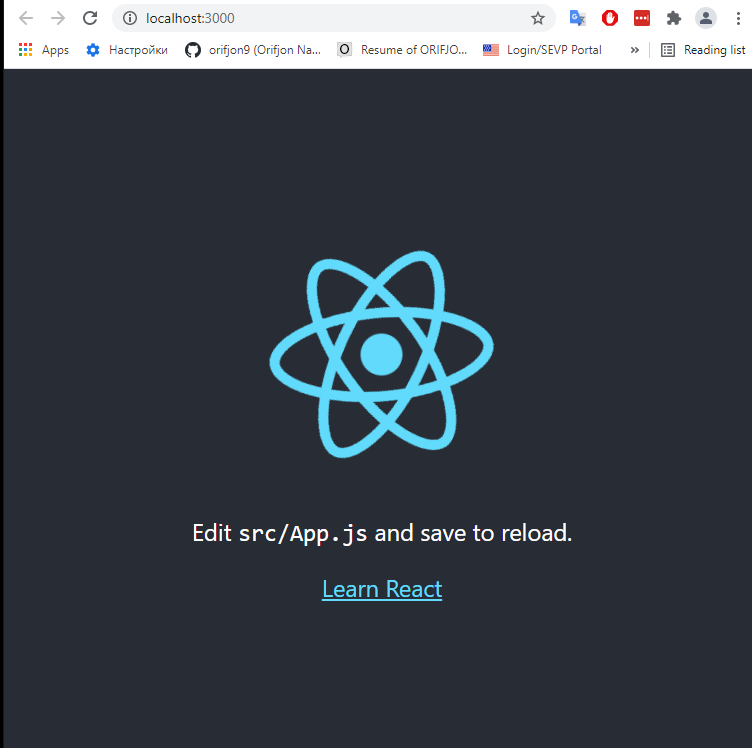

# Run a react app on linux

## Setup and install tolls

`sudo apt-get update` make sure app repositories up to date\
`sudo apt-get install nodejs` install nodejs first\
`sudo apt-get install npm` install node package manager

### check node js version and npm

`sudo node -v`\
`sudo npm -v`\
`sudo npm install -g npx` install npx it needs to create a react app

## Install React

`mkdir react-projects` create a folder were you store all react projects\
`cd react-projects`\
`sudo npx create-react-app my-first-react-app` create a react project

## Run the app
`cd my-first-react-app`\
`sudo npm start` launch the app

## You should see those

